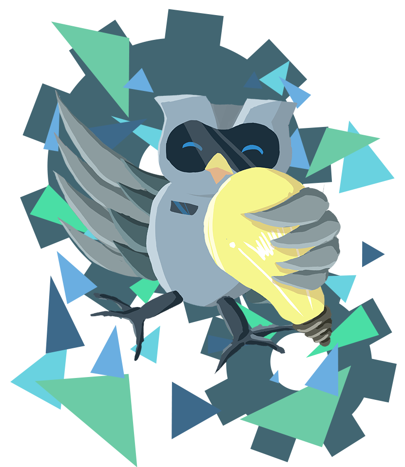

<!-- PROJECT LOGO -->

  

  <h3 align="center">Robotic Camp 2024</h3>

  

    Zombieeee
     
    <a href="https://roboticcamp2024.web.app"><strong>Visit the website »</strong></a>
     
     
    <a href="https://github.com/lewly123/Robotic-Camp-2024/issues/new?assignees=&labels=&projects=&template=bug_report.md&title=">Report Bug</a>
    ·
    <a href="https://github.com/lewly123/Robotic-Camp-2024/issues/new?assignees=&labels=&projects=&template=feature_request.md&title=">Request Feature</a>
  

<!-- TABLE OF CONTENTS -->

  
Table of Contents

  <ol>
    <li>
      <a href="#about-the-project">About The Project</a>
      <ul>
        <li><a href="#built-with">Built With</a></li>
      </ul>
    </li>
    <li><a href="#usage">Usage</a></li>
    <li><a href="#roadmap">Roadmap</a></li>
    <li><a href="#license">License</a></li>
    <li><a href="#acknowledgments">Acknowledgments</a></li>
  </ol>

<!-- ABOUT THE PROJECT -->
## About The Project

[![Product Name Screen Shot][product-screenshot]](#)

This is a web application built for the **Robotic Camp 2024**. It integrates Firebase services to handle backend functionality and is built using front-end technologies like HTML, CSS, and JavaScript. and will make the camp experience more fun by gamifying different aspects of the event. 

(<a href="#readme-top">back to top</a>)

### Built With

* [![Firebase][Firebase]][Firebase-url]
* [![HTML5][HTML5]][HTML-url]
* [![CSS3][CSS3]][CSS-url]
* [![JavaScript][JavaScript]][JavaScript-url]
* [![JSON][JSON]][JSON-url]

(<a href="#readme-top">back to top</a>)

<!-- USAGE EXAMPLES -->
## Usage

This website allows team leaders to access and track their scores and find their game station locations during the camp. It also includes:

- **Leaderboard and Logs**: Members can check the leaderboard and see logs of interactions, like whether they have received potions from other teams.
- **Inventory Page**: Allows teams to manage their items during the camp.
- **Admin Dashboard**: The Organizing Committee (OC) can assign points to teams from the admin dashboard.

These features ensure the event runs smoothly while adding competitive and interactive elements to the camp activities.

(<a href="#readme-top">back to top</a>)

<!-- ROADMAP -->
## Roadmap

- [ ] Firebase Integration
- [ ] Real-time Database
- [ ] User Authentication
- [ ] Add real-time leaderboard updates
- [ ] Implement advanced game mechanics
- [ ] Enhance the admin dashboard with analytics

See the [open issues](https://github.com/lewly123/Robotic-Camp-2024/issues) for a full list of proposed features (and known issues).

(<a href="#readme-top">back to top</a>)

<!-- LICENSE -->
## License

Distributed under the MIT License. See `LICENSE.txt` for more information.

(<a href="#readme-top">back to top</a>)

<!-- ACKNOWLEDGMENTS -->
## Acknowledgments

* [Firebase](https://firebase.google.com/)
* [Google Fonts](https://fonts.google.com/)
* [Boxicons](https://boxicons.com)

If your name was missed in the acknowledgments, please message me through Discord: `𝓒𝓻𝓮𝓮𝓹𝔂#8378`.

(<a href="#readme-top">back to top</a>)

<!-- MARKDOWN LINKS & IMAGES -->
[Firebase]: https://img.shields.io/badge/firebase-ffca28?style=for-the-badge&logo=firebase&logoColor=black
[Firebase-url]: https://firebase.google.com/
[HTML5]: https://img.shields.io/badge/HTML5-E34F26?style=for-the-badge&logo=html5&logoColor=white
[HTML-url]: https://developer.mozilla.org/docs/Web/HTML
[CSS3]: https://img.shields.io/badge/CSS3-1572B6?style=for-the-badge&logo=css3&logoColor=white
[CSS-url]: https://developer.mozilla.org/docs/Web/CSS
[JavaScript]: https://img.shields.io/badge/JavaScript-323330?style=for-the-badge&logo=javascript&logoColor=F7DF1E
[JavaScript-url]: https://developer.mozilla.org/docs/Web/JavaScript
[JSON]: https://img.shields.io/badge/JSON-000000?style=for-the-badge&logo=json&logoColor=white
[JSON-url]: https://www.json.org/json-en.html
